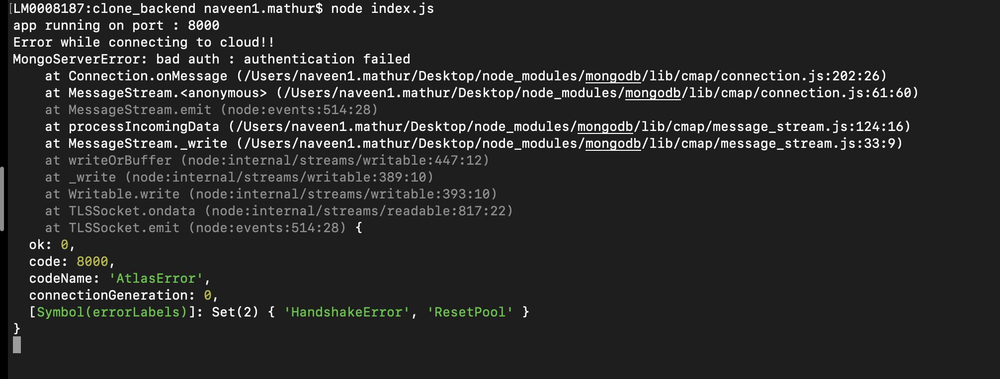

# cloneSpotify

## Commit : 000 [2023-10-18 12:27:23]
1: Added starter files.  

### 🟢 FrontEnd : react js
 command : npx create-react-app app_name 

## Commit : 001 [2023-10-18 13:04:00]
1: setup for frontEnd using [ npx create-react-app name ]  
2: setup for backEnd using [ npm inti -y ]  

### 🟢 npm i express : installs package locally [ i: install ]
### 🟢 will be using cloud for keeping data
### 🟢 database will be made using mongodb on cloud

### 🟢 will use mongodb atlas service provided by mongodb

### 🟢 setting up mongodb cloud using atlas
1: check if overview is visible or not 
2: this database on cloud is not linked with us yet 

## Commit : 002 [2023-10-18 14:01:28]
1: setup cloud-based database using mongodb-atlas  

### 🟢 User Model is part of the backEnd
### 🟢 Database is not linked with the backEnd right now..
### 🟢 mongodb is noSQL database
### 🟢 now index.js doesn't know which database to use and from where
### 🟢 Will use mongoose [ this links NodeJs and mongodb ] package
### 🟢 > Using mongoose to define how will the data look like within the backEnd env

### 🟢 Defined User Model
1: defined user model schema inside backend/models 
2: exported the model, so that it's available to index.js and others as a package 

## Commit : 003 [2023-10-18 14:30:25]
1: Added User model, schema and export  
### 🟢 While creating the song model we do not need to take care in which playlist it is [later]

### 🟢 Regarding model making
1: for song model, artist might not be necessary to be in the model/schema as artist is a user also, so rather than creating the artist in song model we may map id of user(artist) to its songs 
2: playlist will have owner not artist, which can also be handled by the object id of user [mongoose.Types.ObjectId] 
3: While creating the Playlist it make sense that we store songs with id not again with [names, thumbnails etc.] 
4: In Playlist model/schema collaborators are also users so will store them by with their id 

## Commit : 004 [2023-10-18 14:56:28]
1: Added model for a Song and Playlist  
2: created seperate files under models inside backend  

### 🟢 connecting NodeJs to MongoDB
1: the main entry for the server is this index.js file 
2: using mongoose package, will connect db to index.js file 
3: mongoose.connect takes two arguments [ to which db to connect to (db url), options of Connection to connect to 
4: 2nd arg is Connection options 
5: eg: some behind the scene things that mongoose might need (like what kind of quote to use{F})? 
6: While connecting to the mongodb-atlas cloud service [ using connect to application ] 
7: copy the url to connect and enter password/username 
8: Salted Challenge Response Authentication Mechanism (SCRAM) is the default authentication mechanism for MongoDB. When a user authenticates themselves, MongoDB uses SCRAM to verify the supplied user credentials against the user's name , password and authentication database . 
9: While writing the url of the cloud connection we don't need (obviosly) to type our password in the url 
10: [ THIS IS A SECURITY ISSUE, VERY HIGHLY INCASE, ANYONE CAN **** THE DATABASE ] 
11: solution is to use dotenv package 
12: Dotenv is a zero-dependency module that loads environment variables from a .env file into process.env. Storing configuration in the environment separate from code is based on The Twelve-Factor App methodology. 
13: Adding .env file to the backend folder to add dotenv(variable configure) functionality 
14: Basically the logic is: we can add some key-value pairs into the .env file inside the backend dir, 
15: and while sharing our code on github we will add this file to gitignore and so this won't be available to anyone 
16: after that in the 2nd arg: [ userNewUrlParser, useUnifiedTopology ] will be uesd with [true] values 
17: To use the new parser, pass option { useNewUrlParser: true } to MongoClient. connect. The MongoDB Node. js driver rewrote the tool it uses to parse MongoDB connection strings. Because this is such a big change, they put the new connection string parser behind a flag. 
18: serverSelectionTimeoutMS - With useUnifiedTopology , the MongoDB driver will try to find a server to send any given operation to, and keep retrying for serverSelectionTimeoutMS milliseconds. If not set, the MongoDB driver defaults to using 30000 (30 seconds). 
19: we may use this code snip to confirm if the cloud is connected or not  
20: in simple words while connecting with Atlas Cluster we can't use our account password by which we login to the Atlas website. In both case we can reset our cluster password and solve this issue. 
21: if there is an issue/error  
### 🟢 While stuck on cloud connection use [ https://stackoverflow.com/questions/55695565/error-message-mongoerror-bad-auth-authentication-failed-through-uri-string ]
### 🟢 issue : resolved : MONGO_PASSWORD was not working in index.js file, got rid of the quotes

## Commit : 005 [2023-10-18 16:52:56]
1: Successfully build a connection between the Mongodb-cloud-atlas-database with the index.js file using mongoose  
2: Learnt a new method while authenticating to connect with the atlas-cloud  
3: the new method uses .env file [ process.env.VAR_NAME ] types to get fields which might contain sensitive information  
