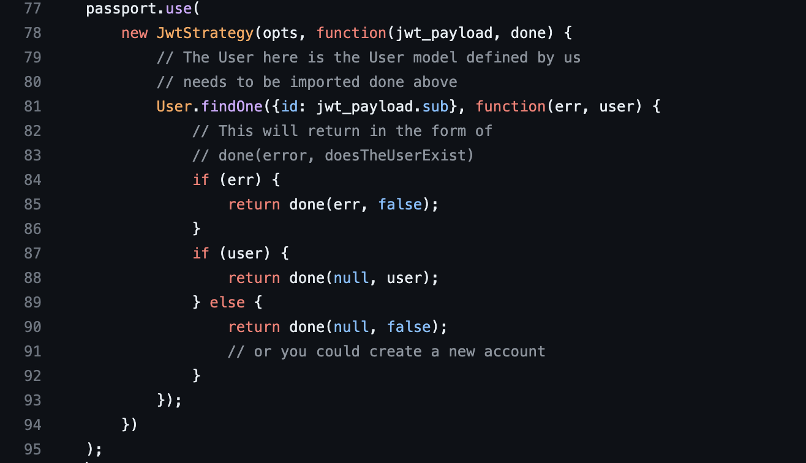

# cloneSpotify

## Commit : 000 [2023-10-18 12:27:23]
1: Added starter files.  

### 🟢 FrontEnd : react js
 command : npx create-react-app app_name 

## Commit : 001 [2023-10-18 13:04:00]
1: setup for frontEnd using [ npx create-react-app name ]  
2: setup for backEnd using [ npm inti -y ]  

### 🟢 npm i express : installs package locally [ i: install ]
### 🟢 will be using cloud for keeping data
### 🟢 database will be made using mongodb on cloud

### 🟢 will use mongodb atlas service provided by mongodb

### 🟢 setting up mongodb cloud using atlas
1: check if overview is visible or not 
2: this database on cloud is not linked with us yet 

## Commit : 002 [2023-10-18 14:01:28]
1: setup cloud-based database using mongodb-atlas  

### 🟢 User Model is part of the backEnd
### 🟢 Database is not linked with the backEnd right now..
### 🟢 mongodb is noSQL database
### 🟢 now index.js doesn't know which database to use and from where
### 🟢 Will use mongoose [ this links NodeJs and mongodb ] package
### 🟢 > Using mongoose to define how will the data look like within the backEnd env

### 🟢 Defined User Model
1: defined user model schema inside backend/models 
2: exported the model, so that it's available to index.js and others as a package 

## Commit : 003 [2023-10-18 14:30:25]
1: Added User model, schema and export  
### 🟢 While creating the song model we do not need to take care in which playlist it is [later]

### 🟢 Regarding model making
1: for song model, artist might not be necessary to be in the model/schema as artist is a user also, so rather than creating the artist in song model we may map id of user(artist) to its songs 
2: playlist will have owner not artist, which can also be handled by the object id of user [mongoose.Types.ObjectId] 
3: While creating the Playlist it make sense that we store songs with id not again with [names, thumbnails etc.] 
4: In Playlist model/schema collaborators are also users so will store them by with their id 

## Commit : 004 [2023-10-18 14:56:28]
1: Added model for a Song and Playlist  
2: created seperate files under models inside backend  

### 🟢 connecting NodeJs to MongoDB
1: the main entry for the server is this index.js file 
2: using mongoose package, will connect db to index.js file 
3: mongoose.connect takes two arguments [ to which db to connect to (db url), options of Connection to connect to 
4: 2nd arg is Connection options 
5: eg: some behind the scene things that mongoose might need (like what kind of quote to use{F})? 
6: While connecting to the mongodb-atlas cloud service [ using connect to application ] 
7: copy the url to connect and enter password/username 
8: Salted Challenge Response Authentication Mechanism (SCRAM) is the default authentication mechanism for MongoDB. When a user authenticates themselves, MongoDB uses SCRAM to verify the supplied user credentials against the user's name , password and authentication database . 
9: While writing the url of the cloud connection we don't need (obviosly) to type our password in the url 
10: [ THIS IS A SECURITY ISSUE, VERY HIGHLY INCASE, ANYONE CAN **** THE DATABASE ] 
11: solution is to use dotenv package 
12: Dotenv is a zero-dependency module that loads environment variables from a .env file into process.env. Storing configuration in the environment separate from code is based on The Twelve-Factor App methodology. 
13: Adding .env file to the backend folder to add dotenv(variable configure) functionality 
13b: Contents of the .env file can be captured by [ process.env ] variable 
14: Basically the logic is: we can add some key-value pairs into the .env file inside the backend dir, 
15: and while sharing our code on github we will add this file to gitignore and so this won't be available to anyone 
16: after that in the 2nd arg: [ userNewUrlParser, useUnifiedTopology ] will be uesd with [true] values 
17: To use the new parser, pass option { useNewUrlParser: true } to MongoClient. connect. The MongoDB Node. js driver rewrote the tool it uses to parse MongoDB connection strings. Because this is such a big change, they put the new connection string parser behind a flag. 
18: serverSelectionTimeoutMS - With useUnifiedTopology , the MongoDB driver will try to find a server to send any given operation to, and keep retrying for serverSelectionTimeoutMS milliseconds. If not set, the MongoDB driver defaults to using 30000 (30 seconds). 
19: we may use this code snip to confirm if the cloud is connected or not  
20: in simple words while connecting with Atlas Cluster we can't use our account password by which we login to the Atlas website. In both case we can reset our cluster password and solve this issue. 
21: if there is an issue/error  
### 🟢 While stuck on cloud connection use [ https://stackoverflow.com/questions/55695565/error-message-mongoerror-bad-auth-authentication-failed-through-uri-string ]
### 🟢 issue : resolved : MONGO_PASSWORD was not working in index.js file, got rid of the quotes

## Commit : 005 [2023-10-18 16:52:56]
1: Successfully build a connection between the Mongodb-cloud-atlas-database with the index.js file using mongoose  
2: Learnt a new method while authenticating to connect with the atlas-cloud  
3: the new method uses .env file [ process.env.VAR_NAME ] types to get fields which might contain sensitive information  

### 🟢 Authentication : Passport
1: passport : package : help to ease in authentication 
2: jwt : JSON web token 
3: to transmit things securly 
4: need two packages: passport, passport-jwt 
5: documentation : [https://www.passportjs.org/packages/passport-jwt/] 
6: Copy the code for passport written in the documentation 

## Commit : 006 [2023-10-19 10:44:41]
1: Authenticating via passport-jwt : setup  
2: Used the documentation of passport-jwt and copied the code of finding valadity of the user by using findOne in User model  

### 🟢 Implementing authentication : signUP
1: will be creating a route for signup, 
2: will put a post request to create a new user 
3: while sending newUserData we need to encrypt the userPasswords and other sensitive info 
4: we can't store it simply in the data-base as plain text 
5: this possess a high vulnerability risk : with users and on owners as well 
6: for encrypting we may use bcrypt library 
7: Creating a utils folder where we'will store the functions which are helpers like getToken and others 
8: never ever store the simple passwords of users anywhere in the database 
9: even delete the user password 

## Commit : 007 [2023-10-19 11:51:12]
1: implemented the code for the new user to register  
2: checking if the user already exists with the provided email id  
3: if not then hashing the password and then creating a new user after generating token  
4: then returning the token generated to the user with hashedPassword  
5: storing only the hashedPassword in the database and deleting the user password  
### 🟢 jwt not installing : try jsonwebtoken

### 🟢 Testing new user creation, and fixing issues
1: we need to send the token secretly as well 
2: left with importing auth files to the index.js 
3: nodeJs need to be told to use JSON 
4: for errors in connecting : https://stackoverflow.com/questions/61937581/error-could-not-connect-to-any-servers-in-your-mongodb-atlas-cluster 
5: use Network access to add ip if problem persists 
6: this will resolve the issure : [Could not connect to any servers in your MongoDB Atlas cluster] 
7: Established Connection with cloud, will now use postman 

### 🟢 Testing using postman
1: sending post req on http://localhost:8080/auth/register 
2: getting an error like  
3: after resolving error, and estabilishing the connnection  
4: we can also see the data stored on the cloud atlas as  
5: haven't setup any logs yet, might be next 
6: we can see the status code on the post request output as [200, ok]  

## Commit : 008 [2023-10-19 14:16:02]
1: tested post request for creating a new user via postman  
2: resolved some errors regarding connection and bcrypt.hash function  
### 🟢 for login it will also come inside the auth.js file in routes as '/login' is also a route

### 🟢 implementing login functionality
1: if email of the user is correct then for checking password is correct or not is a tricky step 
2: to avoid hash collison we can user parameters which are not same for an user 
3: we may user bcrypt.compare function which checks if the hash of the password matches with the user's already stored hashed password 
4: sending same error messages while generating some login access user or others is a nice security management 
5: same msg provides the user a sense that from all the credentials atleast one is incorrect, leaving the user to figure out which of his credentials is wrong, whereas for hackers it gives them no chance to figure out which field is wrong 
6: if say only email is wrong is being msged then hacker can figure out the password it has belongs to some user 
7: if users are low in number of important users then F*** the database 
8: after generating the token return it to the user as a json obj and delete the user password 

## Commit : 009 [2023-10-19 14:52:15]
1: implemented '/login' functionality just like '/register' functionality  
2: for comparing hash of passwords use the bcrypt.compare function to compare the hash of the palintext and the hashed password  

### 🟢 Adding create song route
1: will be implemented inside the routes and with the auth.js 
2: need a middleware while creating /create route after /song 
3: the authenticate will identify wherhter the user is valid or not using the token 
4: we will get the details for song like [name, thumbnail, track] from the req body but for artist we need it as a user and  thus, will access by user.\_id 
5: after that will return the status [301] after the song is created \ 

## Commit : 010 [2023-10-19 15:41:35]
1: implemented /song/create route  
2: need to test it as well using postman  

### 🟢 Adding Get my songs route and testing song routes
1: encountering error : [https://stackoverflow.com/questions/75649330/mongooseerror-model-findone-no-longer-accepts-a-callback-at-function]  
2: have to change line from documentation to const user = await User.findOne( .. .. .. . .) 
3: after resolving the issue(which was User.findOne can't accept a callback function any more ) 
4: have to change this function as a const var like this  
5: to this  
6: final output looks like this  
### 🟢 While having connectivity error 
### 🟢 to resolve change the current ip 
### 🟢 always check if route is correct or not

## Commit : 011 [2023-10-20 11:16:36]
1: implemented /get/mysongs api to get a user's songs  
2: fixed bugs/issues which were due to old jwt code from documentation and url issue in postman  

### 🟢 Get songs by artist and song name
1: implementing /song/get/artist and /song/get/songname 
2: good to implement the search function that can match patterns rather than specific name for the song 
3: multiple songs can be there with same name 
4: This particular thing can be handled by using {Mongodb queries} 
### 🟢 can match patterns while searching for some song/artist or playlist and this can be implemented using [ mongodb queries ]

## Commit : 012 [2023-10-20 12:09:16]
1: implemented the getting song by its name /get/songname and all the songs of an artist /get/artist  

### 🟢 Implementing the playlist creation and userid's playlist
1: while creating a route we need to use via app in index.js 
2: we might have options for creating a playlist like creating a new playlist while adding a new song or 
3: empty playlist or adding a song to some playlist 
4: while getting a playlist after searching, we will get it by a playlistId which should be visible inside the url 
5: so we need to make the route with specific playlistId [ /get/:playlistId ] 
6: here :playlistId is kindof acting as a variable 
7: so if we call /playlist/get/xxxxxxxxx 
8: this will surely call this api and 

### 🟢 Important concept : req.params : while posting a get request we cannot send data : thus if we have defined any variables inside url we can use those params as variable to get data

## Commit : 013 [2023-10-20 13:07:05]
1: created two api's for creating playlist and getting a playlist data using a playlistId  
2: testing left!!  

### 🟢 get playlists for artist using artistId
1: there are two scenerio(s) 
2: // a) if artist exits and has no playlists 
3: // b) artist doesn't exist 
4: // in both the cases : we will get a same empty array 

## Commit : 014 [2023-10-20 13:42:18]
1: implemented a get playlist for an user with the artistId  
2: and adding a song to a playlist  
3: performed security checks while adding the song  

### 🟢 Testing song and playlist api's
1: after performing checks getting server crashed after passing artistId with different lengths 
2: if passing Id's with same length then its getting an empty data json obj 
3: we can see that the url in the songs allows spaces which is not a good way 
4: as it might led to breakdown of url or others  
5: also we are not getting an error on an unknown song which is not in database  
6: while creating a playlist using an empty list of songs we get  
7: haven't added the api for adding songs while creating the playlist 
8: After adding playlists we can use them for testing corresponding to a user 
9:  
10: getting list of playlist by usig artist id  
### 🟢 Got a bug while adding a song in the playlist
### 🟢 in get/artist/:artistId error msg not showing
### 🟢 in get playlist from artistId not working
### 🟢 in database not storing hashed password

## Commit : 015 [2023-10-20 17:00:43]
1: completed testing of api : adding a song in the playlist : got a bug  
2: completed testing of api : getting playlist by artistId  : no bug  
3: bug += 1 : database not showing the hashed-passwords  
4: bug += 1 : error msg is not showing while in get/artist/:artistId  

### 🟢 Fixing bugs
1: bug 1 :  : even if we send wrong artistId then it doesn't show error 
2: the User.find function is giving a empty array so its not showing error 
3: just found a type error in the /add/song api 
4: code :  and debug :  
### 🟢 Object Comparison Basics : When comparing objects in JavaScript, we cant use the regular comparison operators ( == or === ) because they only check for reference equality, not structural equality. In other words, they check if two objects are the same object in memory, not if they have the same properties and values.
### 🟢 for comparing two objects we need to use var1.equals(var2) syntax [ jS ]
### 🟢 after adding the song to a owned playlist 

## Commit : 016 [2023-10-21 11:16:50]
1: fixed bugs occurred while previous testing  

### 🟢 ADding Tailwind CSS to React JS
1: tailwind css is a type ladder 
2: changed element script in package.json inside frontend folder 
3: added craco commands 
4: created craco.config.js file at root of the folder with [info from doc] 
5: The doc [ https://v2.tailwindcss.com/docs/guides/create-react-app ] 

### 🟢 Commit : 017 [2023-10-22 14:42:57]
1: added support for frontEnd  
2: added tailwind and craco support and started webserver for frontend  
3: using tailwind documentation  

### 🟢 added "theOtherId" as a collaborator
